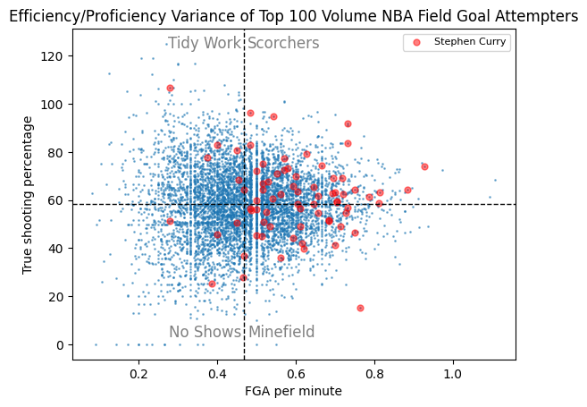
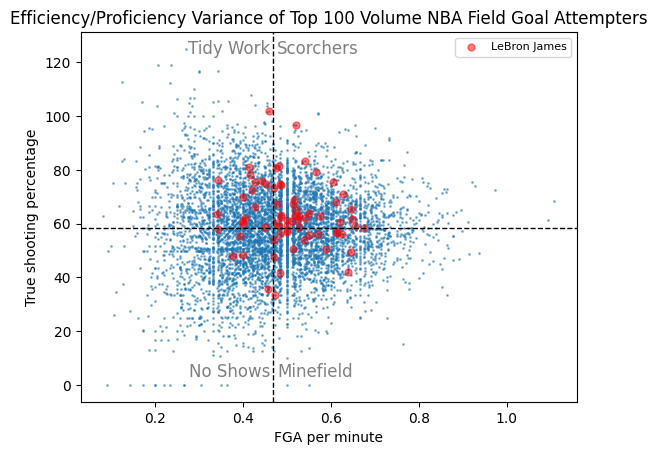

# Consistent-Scorers
A Small Jupyter Notebook program that pools together scoring efficiency & volume of the top scorers in the NBA to create a plot to compare the consistency of individual scorers.

